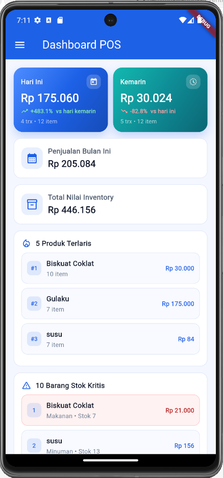
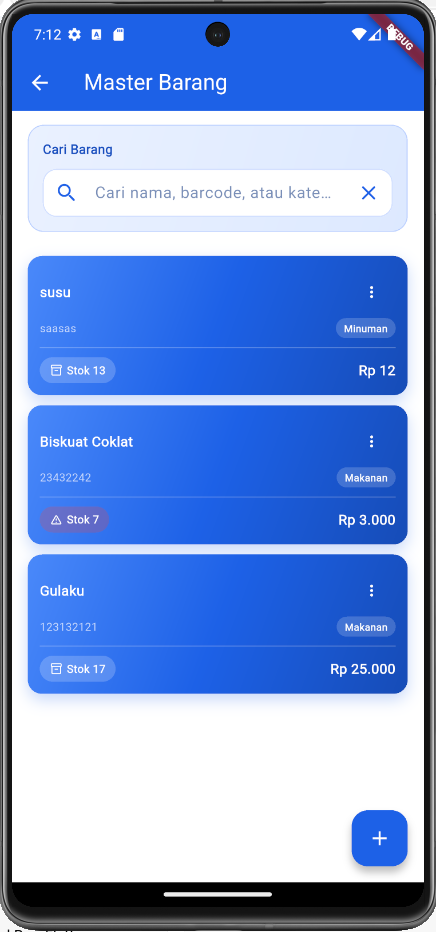
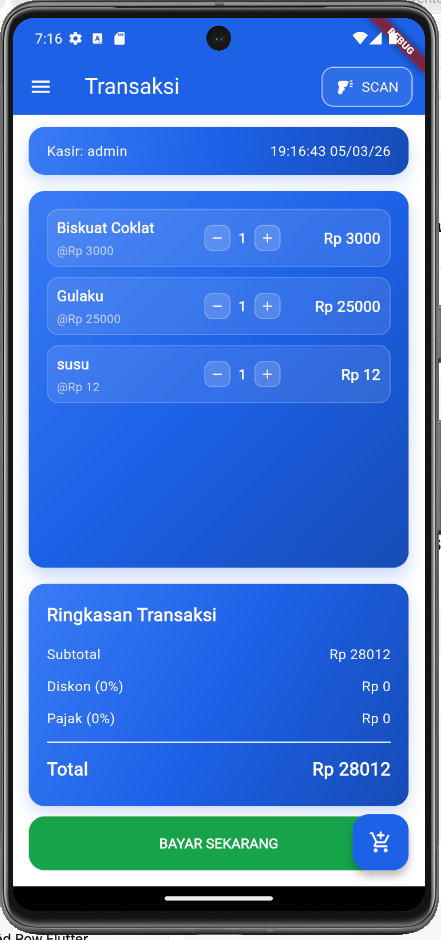
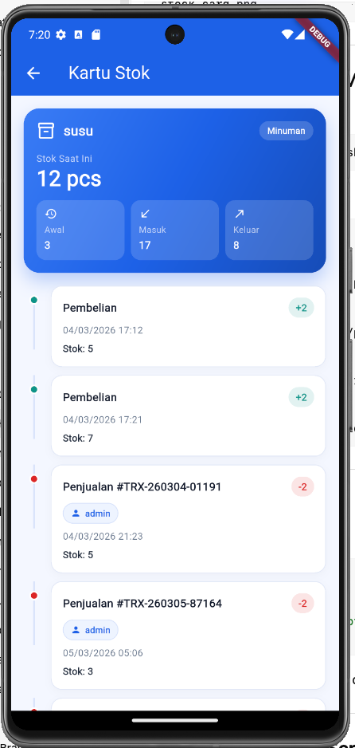
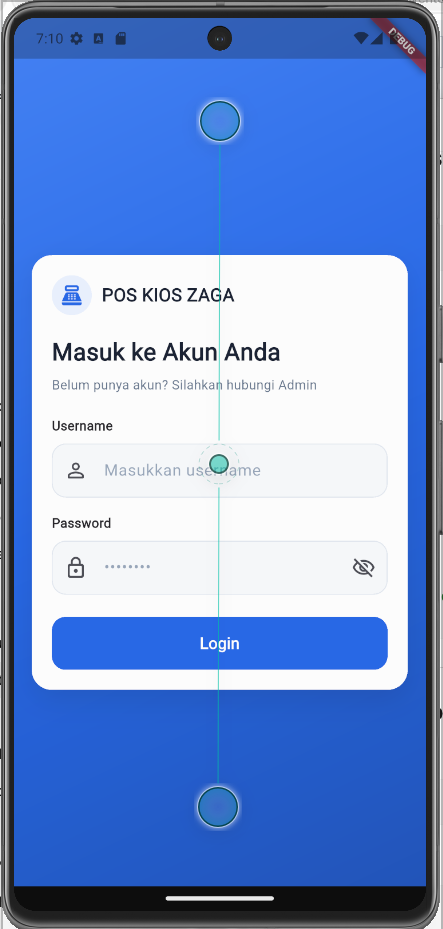
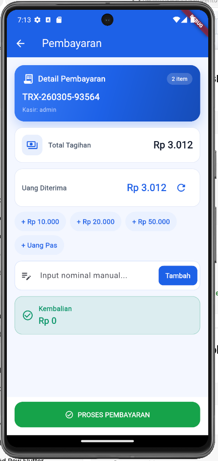
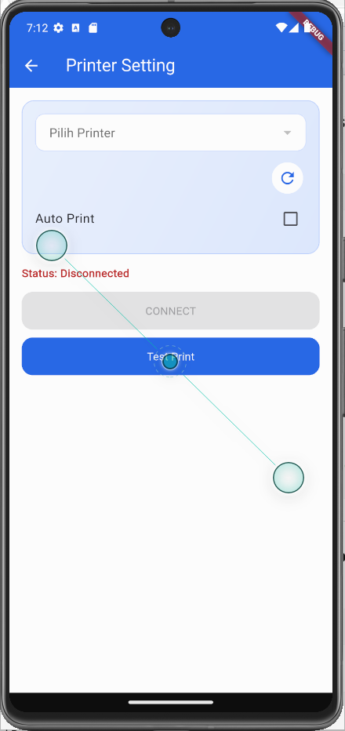
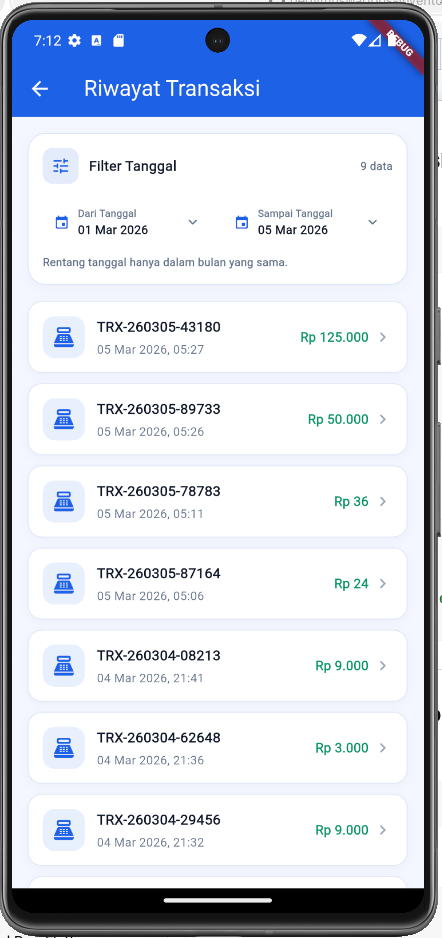
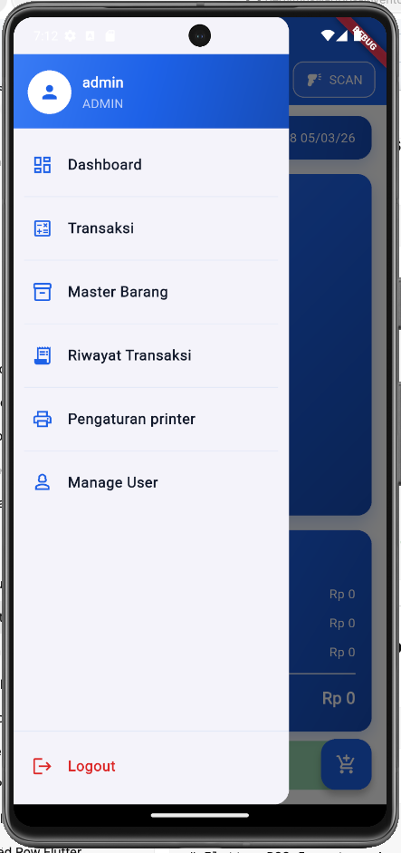

# Flutter POS Inventory App ZAGA

A Point of Sale (POS) and Inventory Management ZAGA application built using Flutter and SQLite with the following features:

## Features
- Product Management
- POS Transactions
- Stock Movement Tracking
- Restock Inventory
- Dashboard Summary
- Print Thermal Bluetooth Receipt
- Manage Users and Permissions

## Tech Stack
- Flutter
- Dart
- SQLite
- Provider

## Screenshots

## App Preview

  
  
  
  
  
  
  
  
  

